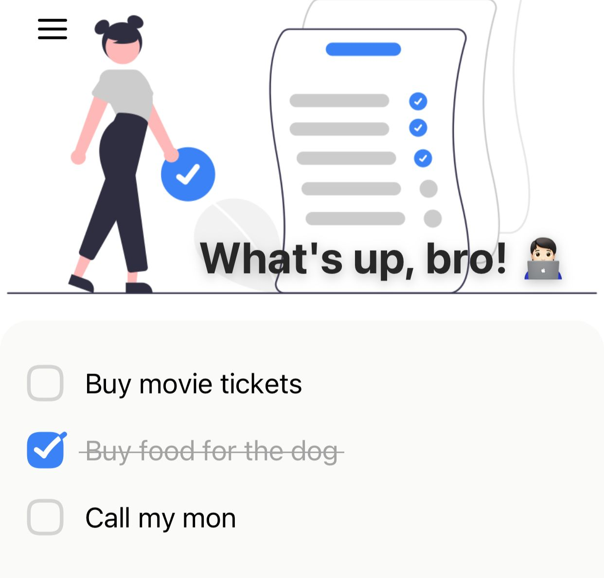

# Animated Todo App


<br />
<br />

A simple to-do app but with some animation using React Native Reanimated!


## Ingredients

- [React Native](https://reactnative.dev/) - ReactJS-based framework for mobile
- [Expo](https://expo.dev/) - Toolset for building RN apps
- [React Navigation](https://reactnavigation.org/) (v6) - Routing
- [Native Base](https://nativebase.io/) - Themable component library
- [React Native Reanimated](https://docs.swmansion.com/react-native-reanimated/) - Animations
- [React Native SVG](https://github.com/react-native-svg/react-native-svg) - SVG Library for RN
- [Moti](https://moti.fyi/) - Helper module for Reanimated 2

## What do I need to run this app

1. Node
2. Yarn
3. Expo

## How to run

1. Pull this repo in your machine;
2. In the terminal, go to the folder containing this project;
3. Run this command:

    ```yarn install```

4. Then run the command:
    ```yarn start```

5. When the Expo is started, scan the QRCode with the app Expo Go, that you can find on Play Store or App Store;
6. Have fun! 😁

## Tutorial

I based this app in this [tutorial](https://www.youtube.com/watch?v=k2h7usLLBhY) so all the credits go to this awesome man [devaslife](https://github.com/craftzdog), どうもありがとうございました! (Thank you very much!)

## Improvements list

- [x] Create App
- [x] Make the app work
- [ ] Add an about screen
- [ ] Add a login screen
- [ ] Save the tasks in the AsyncStorage

## How to contact me


<hr />

Developed with 💜 and ☕ by [CaueFurui](http://github.com/cauefurui)
